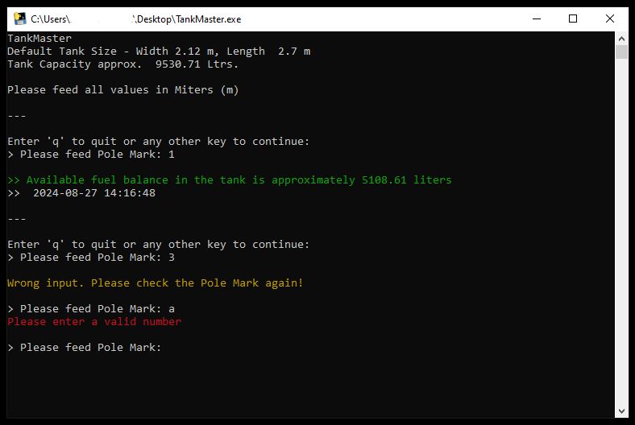

# Tank-Master--Tank-Volume-Calculator
This application is ideal for determining the approximate volume of liquids, such as fuel or water, in a horizontally placed cylindrical tank. You can adjust the tank’s radius and length to match the specific tank you are considering. ‘Pole mark’ refers to the height from the existing liquid level to the top of the tank.

## App Interface

  
 

